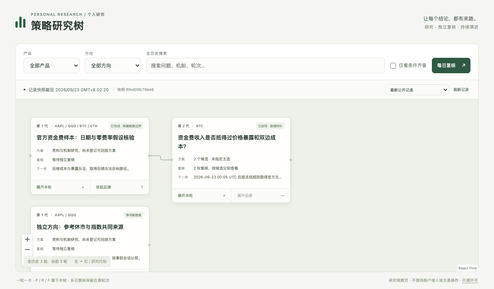
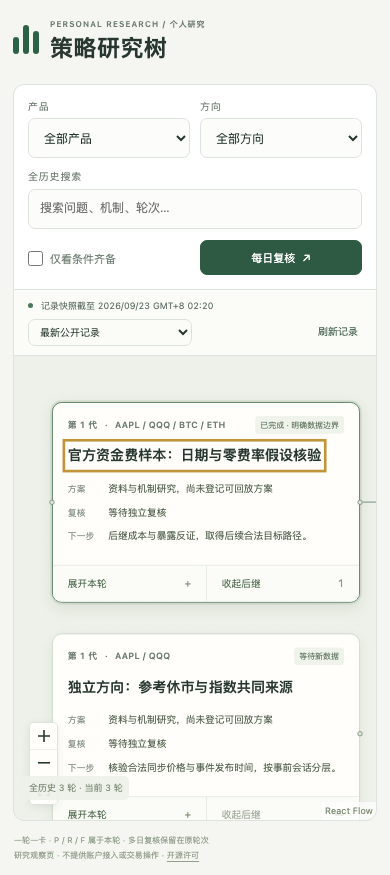

# React Flow 前端实现与验收

2026-09-23：正式前端已用真实 React Flow 构建。最终 Chromium / WebKit **54 项通过，0 失败、0 跳过、0 flaky**，耗时 28.31 秒。记录来自可复跑浏览器检查，涵盖 12 个规模组合、390px、键盘、时效、历史、发布失败、公开证据核验和真实文件提交链路。另以正式公开投影显示 3 个真实研究轮次；这不代表自然任务已经运行、策略已获经济支持或 Pages 已发布。

## 实现与运行

| 项目 | 实际结果 |
|---|---|
| 组件 | React 19.3.0、React DOM 19.3.0、@xyflow/react 12.11.6；唯一图引擎 |
| 构建 | TypeScript 7.0.2、Vite 8.3.0、@vitejs/plugin-react 6.1.1 |
| 依赖 | `web/package-lock.json` 真实 npm 锁文件；`npm ci`、类型检查和生产构建通过 |
| 依赖检查 | `npm audit --omit=dev`：0 vulnerabilities（本次检查时点） |
| 静态壳 | `web/dist/`；相对 base，可供项目发布器复制到静态站点 |
| 图结构 | 一轮一卡、三行摘要；P / R / F 为本轮内部材料；只有 parent_round_id 派生形成下一代 |
| 数据 | `data/latest.json` → manifest / catalog；字节数与 SHA-256 核验后整体切换 |
| 详情 | `catalog.details` 内容寻址 JSON，按需加载并校验；不下载全部净值/行情 |
| 附件 | `public_attachment_refs` → `catalog.evidence` 白名单；校验字节/hash后纯文本预览或下载 |
| 页面操作 | 只读；没有改图、审批、账户、仓位、资金测算或下单入口 |

从 `web/` 运行 `npm ci && npm run build`。测试运行 `npm run test:browser`；首次测试安装独立浏览器使用 `npx playwright install chromium webkit`。测试不接管用户现有浏览器，不调用模型或行情接口。

## 可复核证据

- 脱敏后的完整回执：[verification.json](../tests/browser/artifacts/verification.json)，含逐项结果、当前源码和锁文件 SHA-256、真实设备/浏览器与规模数据。
- 规模逐组合回执：[scale/](../tests/browser/artifacts/scale/)。
- 合成文件链路回执：[Chromium](../tests/browser/artifacts/integration/chromium-receipt.json)、[WebKit](../tests/browser/artifacts/integration/webkit-receipt.json)。
- 正式公开投影回执：[Chromium](../tests/browser/artifacts/chromium-genuine-projection.json)、[WebKit](../tests/browser/artifacts/webkit-genuine-projection.json)。
- 真实生产追加与源码不变的独立证据由主执行流程保存在 [real-append-c05.json](real-append-c05.json)。它与合成文件链路回执分别记录。

原始 Playwright 报告、trace 与测试存储目录可能包含本机绝对路径，留在本机，不能直接公开。公开回执仅保存相对文件名、哈希、结果及设备信息。

## 验收对应

| 验收 | 已验证的行为 | 证据边界 |
|---|---|---|
| C01 | 实际 React Flow DOM；真实依赖与构建；生产空库显示空状态 | 不回退示例 |
| C02–C03 | 两代分叉、第三代隐藏后继、多日复核；本轮与后继展开互不影响 | 合成结构验收 + 真实两代投影 |
| C04 / D05 | 无 selected_plan_ref 时各候选分别显示；条件标志绑定精确 plan@version | 不取第一个候选、不按收益挑选 |
| C05 | 临时测试目录调用真实 Store.commit_bundle / publish_snapshot，追加复核、反馈、后继与独立方向；刷新即可入树 | 前后 web/src 每文件 hash 相同；合成案例明确标记 |
| C06 | 搜索覆盖全历史摘要和未加载后代；恢复祖先路径；额外来源不复制节点 | 搜索第 10000 轮仍可定位 |
| C07 / B10 | 每日批次按日期/产品筛选、定位具体 review；多日与 revision 并存 | 修订原因与旧版保留可查 |
| C08 | 选不可变历史快照后，未来产品、修订、解释与采用不出现 | 发布器按 as_of 投影；前端不从 latest 拼接历史详情 |
| C09 / E08 | 新快照保持视窗/选中；读取中断、hash错误、未知schema保留最后完整快照并标陈旧 | 普通刷新不重做研究，不自动 fitView |
| C10 | 390×844 可读；按钮有文字；焦点留在抽屉；Escape关闭并回到原控件 | 键盘方向/Delete不能移动或删研究节点 |
| C11 | 总历史 1000/10000 × 已展开渲染 50/100/200；两浏览器实际计时 | 每组合断言真实 React Flow DOM 节点数 |
| C12 | React文本转义；拒绝路径逃逸；禁止 HTML/JavaScript执行；外部链接限http/https；附件核验 | 未公开原件不提供任意下载路径 |
| D01–D07 | 具体版本、来源、schema、有效期、触发、逐项证据与发布器判定；合成/断链/失效/无时区均不高亮 | 浏览器只保留或降级发布器判定，不能自行升格 |
| D04 | 打开页面到期即降级；刷新不续期；系统时钟跳变降级 | 原模拟仓位不因标志过期被宣称平仓 |
| 产品扩展 | 配置读产品；@version引用筛选；同产品目录版本去重 | 测试INTC不写入生产活动名单 |
| 浏览偏好 | 不在当前目录的已保存筛选清除并显示提示 | 不出现下拉“全部”但暗中仍筛空的状态 |

## 实际设备与规模

设备：Apple M5，10 核，16 GB，arm64，Darwin 27.0.0。浏览器为独立测试实例：Chromium 153.0.8010.12、WebKit 26.6。规模视窗 1280×720；移动端 390×844。

“渲染节点”表示当前展开图中实际存在的 React Flow DOM 节点，而非总历史量；保持可读缩放时，屏幕可见范围只是这些节点的一部分。测试没有声称 200 个节点可以在一屏同时清晰阅读，也没有将这些档位设为产品上限。每项仅为本次设备上的一次测量，不是通用性能保证。

| 浏览器 | 总历史 | 渲染节点 | 首次加载及展开 ms | 搜索结果 ms | 缩放点击 ms |
|---|---:|---:|---:|---:|---:|
| Chromium | 1000 | 50 | 333.6 | 23.1 | 38.6 |
| Chromium | 1000 | 100 | 423.8 | 34.2 | 37.2 |
| Chromium | 1000 | 200 | 585.4 | 80.5 | 50.6 |
| Chromium | 10000 | 50 | 552.0 | 26.7 | 33.1 |
| Chromium | 10000 | 100 | 636.5 | 36.7 | 38.4 |
| Chromium | 10000 | 200 | 790.0 | 74.6 | 53.0 |
| WebKit | 1000 | 50 | 208.4 | 35.8 | 52.7 |
| WebKit | 1000 | 100 | 262.4 | 51.8 | 44.2 |
| WebKit | 1000 | 200 | 459.3 | 76.3 | 65.5 |
| WebKit | 10000 | 50 | 371.4 | 43.6 | 56.0 |
| WebKit | 10000 | 100 | 428.3 | 45.5 | 51.1 |
| WebKit | 10000 | 200 | 625.4 | 77.4 | 58.2 |

10000 轮合成 catalog 为 6,994,478 bytes。摘要目录当前整体读取；详情和证据按需读取。今后更大目录如有实际压力，应先测量再演进索引，不能据此宣称无限规模。

## 正式记录的实际展示

本次两浏览器加载的真实公开投影：

`8fed09b78ee830b69e2e50c8a7706b84fc12e238f89a2f819252c0d3bcc2510c`

记录快照截至 `2026-09-22T18:20:38.520520Z`；26 个公开记录对象、3 个研究轮次。顶部明确称“记录快照截至”，不能把发布时点当成资金费行情截止。两浏览器均实际点击允许公开的证据附件，并通过字节数/SHA-256检查，JavaScript页面错误列表为空。这里通过本地测试服务器读取同一不可变公开文件，**不是 GitHub Pages 远端回读证明**；远端发布由主执行流程另外确认。

## 本轮发现与修复

1. 复核原件同时含 plan_ref 时，详情标题曾优先显示方案引用；已改为准确的 record_ref / review_id，具体 revision 可定位。
2. WebKit极快切换历史时出现过一次节点尺寸未测量而隐藏；现已保存受控测量状态，并让 ResizeObserver持续更新，不固定卡片高度。
3. 旧浏览偏好中的英文机制筛选在新中文方向目录中失效；现已清除无效筛选并提示。
4. 真正公开附件在原记录中只有局部文件名，无法安全定位；发布器已补充完整 public_attachment_refs，前端不猜同名附件。
5. “数据截至”容易混淆行情和记录时点；已改为“记录快照截至”。

上述修复后的最终完整运行是 54/54；没有用失败重跑的局部结果替代完整回归。

## 尚不能由前端证明的事项

前端验收不证明自然原生任务触发、两个不同自然研究时点、自然日复核、真实反馈被未来后继采用、公开远端可恢复或研究盈利。它们由本项目独立证据与验收矩阵记录；未来窗口不能用本报告中的合成测试替代。

组件实现依据官方 React Flow [子流程](https://reactflow.dev/learn/layouting/sub-flows)与[性能](https://reactflow.dev/learn/advanced-use/performance)文档；安装时按 npm 实际 peerDependencies 与 [Vite运行要求](https://vite.dev/guide/)核验兼容性。
